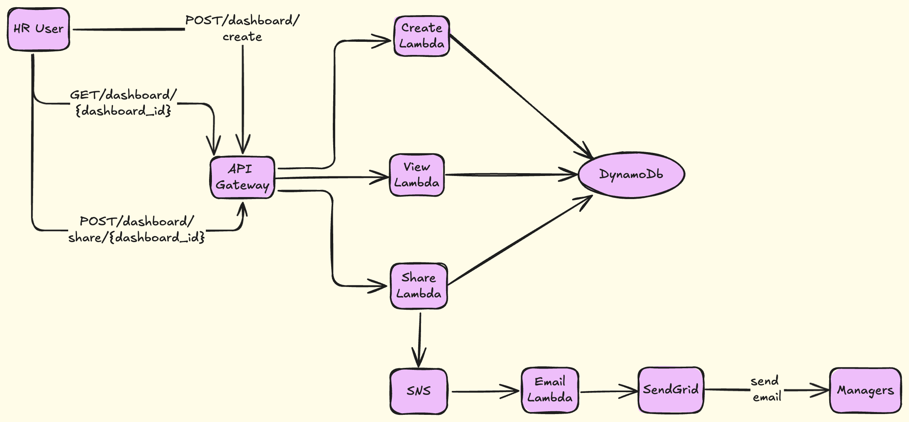

# HR Dashboard Sharing System using AWS, Python & SendGrid

## 📌 Project Summary

A scalable backend system that enables HR Practitioners to create, view, and share dashboards with managers. Dashboards track:

* Headcount  
* Payroll Cost  
* Total Overtime Hours  

When shared, managers receive notifications via email, push (mocked), and in-app messages.  
HR can also view a report of notification delivery success or failure.

## 👤 Personas

* HR Practitioners: Create, View, Share dashboards, and View Notification Reports  
* Managers: Receive notifications via email, push, and in-app messages  

## 🧰 Technologies Used

* AWS Lambda – Stateless compute logic for all operations  
* API Gateway – Exposes RESTful HTTP endpoints (Postman-compatible)  
* DynamoDB – Stores dashboards, email logs, and in-app notifications  
* SNS – Triggers downstream processing (email/push/in-app)  
* SendGrid – Sends actual notification emails  
* CloudWatch – Logs and monitors Lambda executions  

## 🗃️ Folder Structure

adp_dashboard_project/  
├── architecture.txt  
├── db_schema.txt  
├── api_spec.txt  
├── README.md  
├── postman_collection.json  
├── lambda/  
│   ├── create_dashboard.py  
│   ├── view_dashboard.py  
│   ├── share_dashboard.py  
│   ├── email_dispatcher.py  
│   ├── get_email_report.py  
│   └── get_in_app_notifications.py  

## 🔐 IAM Permissions

Each Lambda function is attached to an IAM role with:  
* AmazonDynamoDBFullAccess  
* AmazonSNSFullAccess  
* AWSLambdaBasicExecutionRole  

## 🌐 API Endpoints

| Method | Endpoint                              | Description                                    |  
|--------|----------------------------------------|------------------------------------------------|  
| POST   | /dashboard/create                     | Create a new dashboard                         |  
| GET    | /dashboard/{dashboard_id}             | View dashboard details                         |  
| POST   | /dashboard/share/{dashboard_id}       | Share dashboard with managers (chunked)        |  
| GET    | /dashboard/report                     | View email delivery success/failure summary    |  
| GET    | /dashboard/notifications              | Fetch in-app messages for a specific manager   |  

## 📩 Notification Format

* Email Subject: Dashboard Shared Notification  
* Email Body: You’ve been granted access to dashboard <dashboard_id>  
* In-App Message: Stored for each manager in DynamoDB  
* Push Notifications: Mocked in logs, can be extended using FCM/APNs  

## ✅ Completed Features

* [x] Create Dashboard (Lambda + DynamoDB)  
* [x] View Dashboard (Lambda + API Gateway)  
* [x] Share Dashboard with chunked recipients (Lambda + SNS)  
* [x] Multi-channel Notification Dispatcher (email, push, in-app)  
* [x] Email Reporting for HR (success/failure logs)  
* [x] In-App Notification History for Managers  
* [x] Fully Testable with Postman  

## ⚠️ Note on Scalability

For large manager lists (e.g., 15,000+), the shared_with field only stores a batch_id, not individual emails, to avoid DynamoDB’s 400KB item size limit.  
Each manager receives notifications in chunks, processed asynchronously via SNS → Lambda.

## 🧪 Postman Testing Guide

1. Create Dashboard  
POST /dashboard/create  
Body:  
{  
  "created_by": "hr1@adp.com",  
  "name": "Payroll Snapshot - May 2025",  
  "headcount": 120,  
  "payroll_cost": 95000,  
  "overtime_hours": 320  
}  

2. View Dashboard  
GET /dashboard/dash_XXXXXX  

3. Share Dashboard  
POST /dashboard/share/dash_XXXXXX  
Body:  
{  
  "recipients": {  
    "emails": ["manager1@example.com", "manager2@example.com"],  
    "chunk_size": 2,  
    "batch_id": "batch-may2025"  
  },  
  "channels": ["email", "push", "in_app"]  
}  

4. Get Email Report  
GET /dashboard/report?dashboard_id=dash_XXXXXX  

5. Get In-App Notifications  
GET /dashboard/notifications?user_email=manager1@example.com  

## 🚀 Future Improvements

* Add authentication with Cognito or JWT  
* Replace mocked push with real service (Firebase or APNs)  
* Add frontend web UI for managers  
* Add input validation and rate limiting  
* Create deployment pipeline (CI/CD)  

📁 Fully tested  
🧉 Built for scale  
📩 Email scaled for 15,000 recipients  
📊 Insightful for HR  
